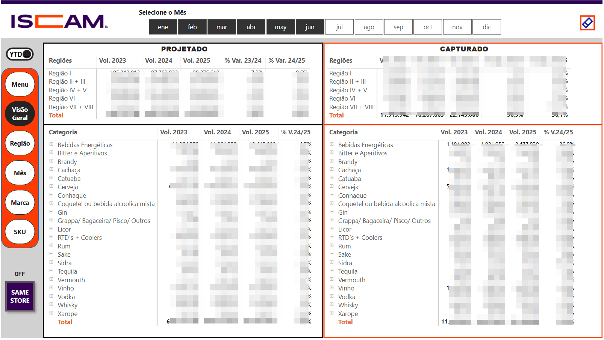
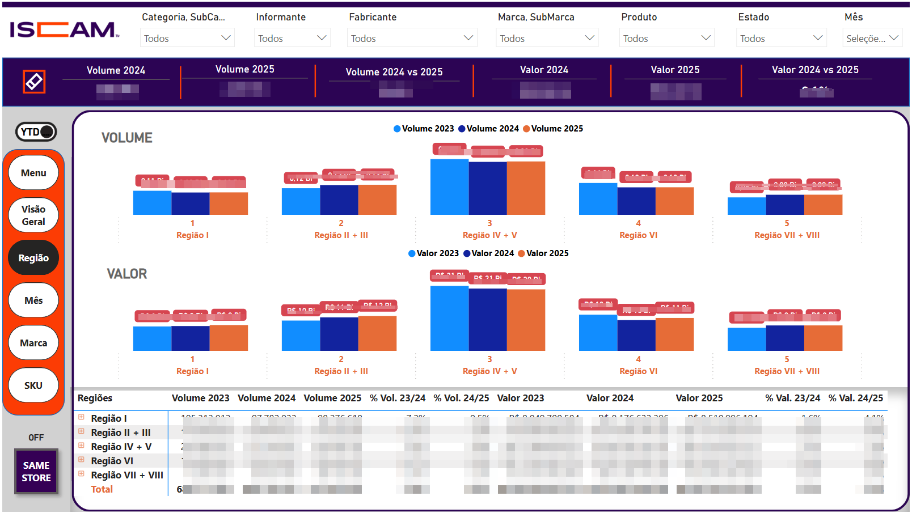
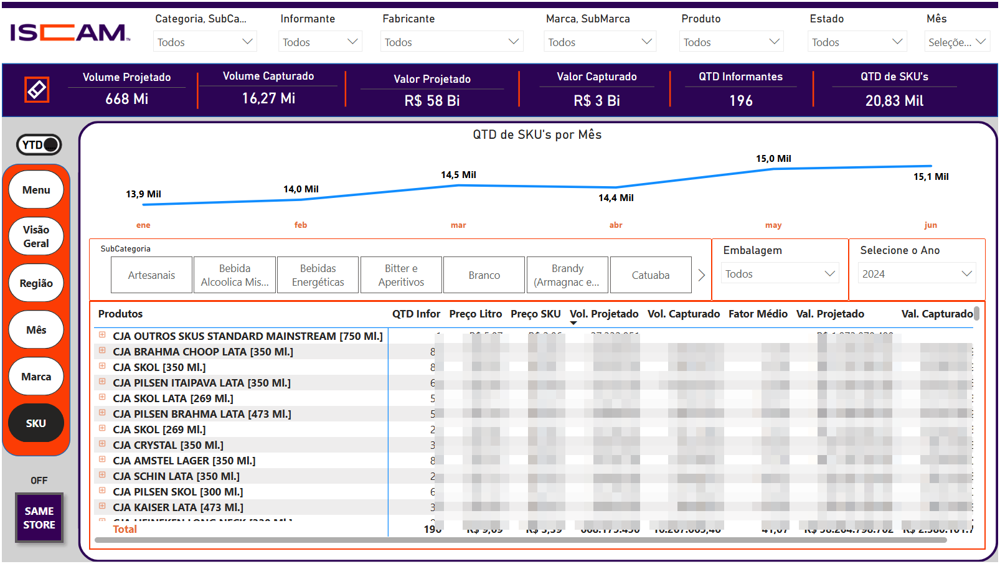

# Dashboard de Diagnóstico Operacional (Power BI)

### Impacto no Negócio: Automação de indicadores críticos (YTD, RY, Same Store).

## Visão Geral do Projeto
Este projeto consistiu no desenvolvimento de um ecossistema de dados para a área de Estatística, focado no mercado de bebidas alcoólicas. A solução consolidou dados massivos (escala de milhões de registros) que anteriormente eram processados manualmente em tabelas dinâmicas no Excel, o qual já não suportava a volumetria.

O dashboard permite a análise detalhada de indicadores de **Volume e Valor**, segmentados por Categorias, Regiões, Marcas e SKUs, auxiliando a gerência na tomada de decisão estratégica baseada em dados reais de mercado.



## Especificações Técnicas e Arquitetura
* **Volume de Dados:** Escala de milhões (Big Data), processados via **Power BI Data Flows** (fluxo de dados web fornecido pela unidade do México) e **SQL Server**.
* **Modelagem de Dados:** Estrutura híbrida de **Star Schema** e **Snowflake**, contando com 10 tabelas interconectadas para garantir a integridade dos filtros.
* **Inteligência de Tempo Dinâmica:**
    * **YTD (Year to Date):** Acumulado do ano até o último mês disponível.
    * **RY (Rolling Year):** Ciclo de 12 meses móveis (ex: Jul/24 a Jun/25).
      
* **Conceito de Mercado:**
    * **Projetado:** Dados dos informantes (distribuidores/fabricantes) somados à expectativa de mercado.
    * **Capturado:** Dados brutos dos informantes, excluindo códigos de projeção.

## 📝 Portfólio DAX (Lógicas Avançadas)

### 1. Cálculo de Rolling Year (RY) Dinâmico
Esta medida gerencia a transição entre anos fiscais, permitindo visualizar os 12 meses anteriores a partir do seletor.

```dax
Vol. RY. = 
VAR AnoAtualRelativo = SELECTEDVALUE(Calendario[Ano])
VAR MesFim = CALCULATE(MAX(SeletorPeriodoDinamicoRY[Mês Número]), ALLSELECTED(SeletorPeriodoDinamicoRY[Mês Número]))
VAR Resultado = 
    CALCULATE(
        [Suma de Volumen],
        FILTER(
            ALL('Calendario'),
            (('Calendario'[Mês Número] > MesFim && 'Calendario'[Ano] = AnoAtualRelativo) ||
             ('Calendario'[Mês Número] <= MesFim && 'Calendario'[Ano] = AnoAtualRelativo + 1))
        )
    )
RETURN COALESCE(Resultado, [Suma de Volumen])
```


### 2. Variação Percentual RY (Capturado)
Esta lógica calcula a variação entre ciclos RY, tratando valores nulos para evitar erros de divisão por zero.

```dax
% Var. RY. CAP Vol. 24/25 = 
VAR Volume_ANO_P = COALESCE([2024 a RY 2025 CAPTURADO], 0) 
VAR Volume_ANO_S = COALESCE([2023 a RY 2024 CAPTURADO], 0)
VAR VariacaoFinal = Volume_ANO_P - Volume_ANO_S
RETURN
    IF(
        Volume_ANO_P = 0, 
        BLANK(),
        DIVIDE(VariacaoFinal, Volume_ANO_S)
    )
```
### 3. Filtro de Volume Capturado
Utiliza uma DATATABLE interna para excluir códigos de informantes específicos usados apenas para projeção.

```dax
Vol. Capturado = 
CALCULATE(
    SUM('Ventas a Sucursales'[Volumen]), 
    NOT 'Tabela_Capturados'[Informante] IN {100, 101, 102, 400}
)
```
### 📂 Estrutura do Dashboard (6 Páginas)

* **Menu:** Central de navegação intuitiva.

* **Visão Geral:** Foco em volume por categoria e região (Últimos 3 anos).

* **Região:** Análise de Volume e Valor com variações anuais (Var 24/25).

* **Mês:** Análise de sazonalidade e comparação mensal entre Volume e Valor.

* **Marca:** Insights sobre market share, quantidade de informantes e fatores de projeção.

* **SKU:** Detalhamento granular de Preço por Litro e filtros por tipo de embalagem.



### 📐 Arquitetura do Modelo de Dados
O modelo foi desenhado utilizando a metodologia **Snowflake Schema** para otimizar o armazenamento e garantir a integridade referencial de dados heterogêneos.

* **Tabela Fato:** `Ventas a Sucursales` (milhões de registros).
* **Normalização:** Dimensões como `Producto` e `Estado` foram normalizadas em subníveis (`Categoría` e `Región`), permitindo filtros granulares sem perda de performance.
* **Integridade:** Relacionamentos 1:N (um para muitos) garantindo que as métricas de volume projetado e capturado sejam distribuídas corretamente entre as 8 regiões.

```text
[ Dim_Categoria ]
              ↑
      [ Dim_Subcategoria ]          [ Dim_Fabricante ]
              ↑                             ↑
        [ Dim_Producto ] <----------- [ Dim_Marca ]
          (SKU/Preço)                       |
              |                             |
              |      +----------------------+
              |      |
              ▼      ▼
      [ Ventas_a_Sucursales ] <--- [ Dim_Calendario ]
        (Fato: Vol/Vendas)          (YTD/RY/Índices)
              ▲      ▲
              |      |
              |      +------------ [ Dim_Informante ]
              |                            ↑
       [ Dim_Estado ]             [ Tabela_Capturados ]
              ↑                   (IDs: 100, 101, 102, 400)
              |
       [ Dim_Region ]
        (8 Regiões)
```
#
### Desafios e Performance

* **Cálculo de Same Store (Amostra Comum):** Devido à complexidade de cruzar informantes idênticos em períodos distintos em uma base de milhões de linhas, o tempo de carregamento varia de 5 a 20 segundos.

* **Evolução do Código:** Como lição aprendida, a metodologia de datação do RY poderia ser otimizada com funções de janela (OFFSET ou DATESINPERIOD), tornando o código mais limpo e eliminando a necessidade de manutenção mensal manual.

---

## 👤 Autor

Desenvolvido por [**Bruno P. Brito**](https://github.com/bpb-bruno) | Email: [contato@brunopbrito.com.br](mailto:contato@brunopbrito.com.br)
